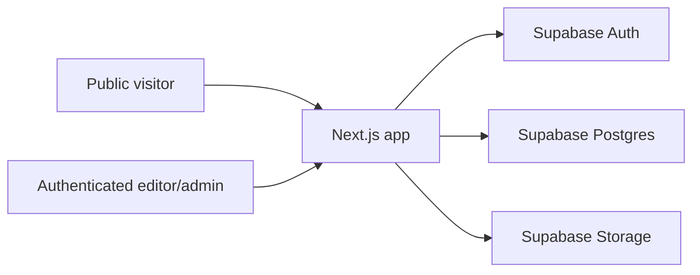

# Architecture

## Current Direction

This repository is a Next.js and Supabase blog platform with:

- bilingual UI in English and Simplified Chinese
- public blog browsing
- authenticated dashboard and post management
- role-aware editorial access
- Supabase Storage-backed media handling
- admin presentation and theme controls
- basic comment moderation and post view tracking

The site UI is bilingual. Blog post authoring is currently single-content-first: the database remains translation-capable, but the editor does not force authors to maintain two language versions for every post.

## Stack

- Framework: Next.js App Router
- UI: React 19 + TypeScript
- Styling: Tailwind CSS
- Shared client state: React Context
- Backend: Supabase
- Database: PostgreSQL
- File storage: Supabase Storage
- Deployment target: Vercel

## High-Level Structure

## Runtime Areas

### Public experience

- locale-aware home page
- blog archive
- post detail pages
- category and tag archives
- SEO metadata
- post view tracking

### Protected experience

- dashboard
- profile page
- post list and editor
- revision history
- media library
- comment moderation

### Admin-only experience

- site presentation settings
- active theme selection
- theme token editing

## Routing Model

### Public routes

- `/{locale}`
- `/{locale}/blog`
- `/{locale}/blog/{slug}`
- `/{locale}/category/{slug}`
- `/{locale}/tag/{slug}`

### Auth routes

- `/{locale}/login`
- `/{locale}/reset-password`
- `/{locale}/update-password`
- `/{locale}/auth/callback`

### Protected routes

- `/{locale}/dashboard`
- `/{locale}/profile`
- `/{locale}/posts`
- `/{locale}/posts/new`
- `/{locale}/posts/{id}`

### Elevated moderation routes

- `/{locale}/media`
- `/{locale}/comments`

### Admin-only routes

- `/{locale}/admin`

## Internationalization

The implementation uses locale-prefixed routing and server-loaded dictionaries.

### What is bilingual today

- navigation
- authentication flows
- dashboard and admin UI
- public site copy
- settings and moderation interfaces

### What is not forced to be bilingual today

- blog post editing workflow

The schema still supports `post_translations`, category translations, tag translations, media text translations, and translated site settings, but the editorial UX currently optimizes for common blog usage instead of requiring parallel language entry for every post.

## Theme Architecture

Theme behavior is split into two layers:

1. Brand theme preset from the database
2. User theme mode preference in the browser (`light`, `dark`, `system`)

The active theme preset is stored in Supabase and loaded into the `ThemeProvider` through the locale layout. Theme tokens are applied as CSS variables, so public and protected pages share the same visual system.

## Content Architecture

### Post data

- `posts` stores shared metadata
- `post_translations` stores locale-specific content
- `post_revisions` stores save snapshots
- `post_views` stores lightweight analytics events

### Current editor behavior

- one locale-specific content form is shown at a time
- the admin editor uses TipTap for text-first structured authoring
- stored content remains in `post_translations.content` as JSON
- published posts need one publish-ready translation, not all translations
- empty translation rows are pruned on save

### TipTap rollout status

- implemented in the current stage:
  - headings
  - paragraphs
  - bold, italic, underline
  - links
  - blockquotes
  - code blocks
  - ordered and unordered lists
  - horizontal rules
- intentionally not implemented yet:
  - inline image nodes
  - inline video nodes
  - table nodes
  - revision diff tooling

## Media Architecture

- files are stored in the `blog-media` bucket
- metadata lives in `media_assets`
- alt text and captions live in `media_asset_translations`
- posts reference media through `posts.hero_media_id`
- editors and admins manage uploads through the media library
- post editors can pick stored media as the cover image

## Comment Architecture

The current implementation covers moderation only.

- comments are stored in `comments`
- status options are `pending`, `approved`, `rejected`, and `spam`
- editors and admins can review and change moderation state
- there is no public comment submission UI yet

## Security Model

### Roles

- `author`
- `editor`
- `admin`

### Enforcement

- application route guards via shared auth helpers
- Supabase RLS on app tables
- Supabase Storage policies on the media bucket

### Practical access rules

- authors manage only their own posts
- editors and admins can manage posts across the workspace
- editors and admins can use moderation routes
- only admins can change site presentation settings and theme presets

## Data Access Pattern

Server-side data access is organized in `src/lib/db/`.

Current repository areas include:

- auth profile loading
- public blog queries
- content post management
- taxonomy access
- site settings
- themes
- media assets
- comments

This keeps page code relatively thin and allows route protection and mutation logic to stay centralized.

## Current Tradeoffs

- post schema remains translation-capable even though the editor is no longer dual-language-first
- public pages still benefit from locale-aware content fallback
- media replacement and deletion are intentionally routed through elevated roles
- theme editing currently focuses on preset activation and token updates, not a fully visual theme builder

## Near-Term Follow-Up Areas

- public comment submission flow
- taxonomy management UI
- richer editorial analytics
- image dimension extraction and stronger media metadata
- broader automated test coverage
