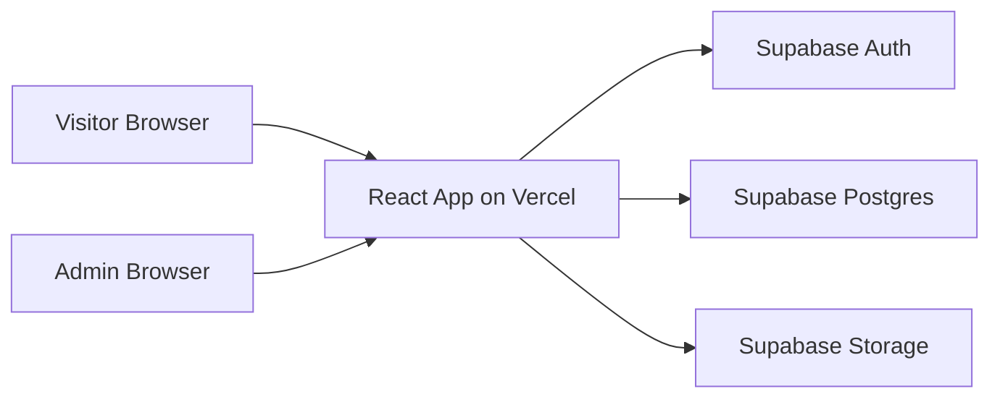

# Architecture

## 1. Requirements Analysis

This repository is currently greenfield, so the architecture can be designed cleanly around the requested platform goals:

- Public-facing blog pages
- Admin dashboard
- Authentication
- Theme management
- Image storage
- Responsive design
- Bilingual experience in Simplified Chinese and English
- Full deployment on Vercel with Supabase as the backend platform

## 2. Recommended Technical Direction

### Core Stack

- Frontend: React + TypeScript
- App framework: Next.js (recommended React framework for Vercel, SEO, routing, and hybrid rendering)
- Styling: TailwindCSS
- State management: React Context for app-wide concerns
- Backend platform: Supabase
- Database: PostgreSQL via Supabase
- File storage: Supabase Storage
- Internationalization: Next.js App Router locale routing + server-loaded dictionaries + browser language detection + persisted preference
- Deployment: Vercel

## 3. Why Next.js Is Recommended

Although the product requirement says React, the best architectural fit is React through Next.js because it improves:

- SEO for public blog pages
- route-based code organization
- server-side rendering and static generation for content pages
- Vercel deployment experience
- performance for public entry pages

If the team wants a pure client-side React app later, that is possible, but it would be a weaker fit for public blog discoverability and page-load performance.

## 4. High-Level System Architecture



## 5. Application Areas

### Public Site

- home page
- blog listing page
- blog detail page
- category and tag filtered views
- search and pagination
- theme switcher
- language switcher
- responsive navigation

### Admin Dashboard

- secure login
- post management
- draft and publish workflow
- revision history
- comment moderation
- media library
- theme configuration
- profile and locale preferences
- dashboard overview metrics

### Shared Platform Capabilities

- auth session handling
- locale detection and persistence
- theme persistence
- route protection
- common layout system

## 6. Frontend Architecture

### Recommended App Structure

```text
src/
  app/ or pages/
  components/
  features/
    auth/
    blog/
    admin/
    media/
    theme/
    i18n/
  contexts/
  hooks/
  lib/
    supabase/
    i18n/
    utils/
  types/
  styles/
public/
  locales/
    en/
    zh-CN/
```

### Contexts

Use React Context only for cross-cutting state that truly needs to be global:

- `AuthContext`: current user, auth status, role checks
- `ThemeContext`: active theme, theme mode, persisted preference
- `LocaleContext`: current language, switch action, preference persistence
- `AppShellContext` (optional): mobile nav state, shared UI controls

Avoid storing server data like posts in Context. Content should be fetched through feature-level data access functions so the app stays scalable.

## 7. Routing Model

### Public Routes

- `/`
- `/blog`
- `/blog/[slug]`
- `/category/[slug]`
- `/tag/[slug]`
- `/about` or other content pages if needed

### Admin Routes

- `/admin`
- `/admin/posts`
- `/admin/posts/new`
- `/admin/posts/[id]`
- `/admin/media`
- `/admin/themes`
- `/admin/settings`

### Auth Routes

- `/login`
- `/reset-password`

## 8. Rendering Strategy

### Public Pages

- use static generation or incremental revalidation for blog list and blog detail pages
- revalidate on publish and update events
- keep translated slugs and metadata pre-renderable

### Admin Pages

- use authenticated client and server rendering as appropriate
- keep admin pages protected behind auth and role checks

## 9. Content Model Strategy

Use language-neutral base tables plus translation tables.

Example:

- `posts` stores shared metadata such as author, status, timestamps, hero image, and SEO flags
- `post_translations` stores locale-specific fields such as title, slug, excerpt, body, SEO title, and SEO description
- `post_revisions` stores historical snapshots for recovery and editorial review
- `comments` stores moderated public discussion linked to posts

This design is better than duplicating `title_en` and `title_zh` across every table because it:

- scales better if more languages are added
- keeps locale content consistent
- simplifies fallback behavior
- cleanly supports unique slugs per locale

## 10. Internationalization Architecture

### Approach

- Next.js App Router locale segments
- middleware-based locale detection and redirection
- server-loaded translation dictionaries
- optional lightweight client locale context for switching and persistence

### Translation Sources

- static UI text: locale dictionaries under `src/messages/en.json` and `src/messages/zh-CN.json`
- dynamic editorial content: translation rows in PostgreSQL

### Language Detection Order

1. logged-in user preference from profile
2. persisted client preference
3. browser language
4. default fallback locale

### Persistence Rules

- anonymous users: store selected locale locally
- logged-in users: store locale in both local persistence and user profile
- server middleware should also respect a locale cookie for first-visit routing

### Navbar Language Switcher

The navbar must expose:

- English
- Simplified Chinese

Switching language should:

- change UI strings immediately
- navigate to locale-appropriate content when applicable
- persist the selection

### Content Fallback Rules

- UI fallback: use default locale if a translation key is missing
- post fallback: show only fully available locale content for public pages
- admin fallback: clearly indicate missing translations for editors

## 11. Theme Management Architecture

### Scope

The system should support more than a dark and light toggle. It should allow branded visual presets managed by admins.

### Recommended Model

- theme tokens stored in database
- active theme reference stored in app settings
- CSS variables generated from the selected theme
- TailwindCSS extended to consume CSS variables

### Example Theme Tokens

- primary
- secondary
- accent
- background
- surface
- text
- muted
- border
- radius
- font heading
- font body

### Behavior

- admin can create, update, activate, and preview themes
- public site reads active theme at runtime or build time
- personal light and dark preference can remain separate from brand theme if desired

## 12. Authentication and Authorization

### Auth

Use Supabase Auth for:

- email and password login
- password reset
- session handling

### Roles

Recommended initial roles:

- `admin`
- `editor`
- `author`

### Authorization

- public users can read published content only
- authenticated admins and editors can access the dashboard
- authors can create and edit their own drafts if that workflow is enabled
- only admins can manage theme settings and global configuration

Enforce authorization in both:

- application route guards
- Supabase Row Level Security policies

## 13. Media and Storage Architecture

### Storage

Use Supabase Storage for:

- post hero images
- inline rich content images
- theme assets if needed

### Bucket Recommendation

- `blog-media`

### Media Rules

- public published assets can be served publicly
- admin upload permissions must be authenticated
- save metadata in a `media_assets` table for search, attribution, and cleanup

## 14. Responsive Design Strategy

The UI should be mobile-first with clear breakpoints for:

- phone
- tablet
- laptop
- desktop

Key responsive areas:

- navbar and language switcher
- blog card layouts
- article typography and image scaling
- admin sidebar and tables
- theme preview panels

## 15. Supabase Responsibilities

### PostgreSQL

- posts
- translations
- comments
- revisions
- view tracking
- categories
- tags
- profiles
- themes
- settings
- media metadata

### Auth

- user identities
- sessions
- password recovery

### Storage

- uploaded images
- derived media references

## 16. Vercel Responsibilities

- host frontend
- manage preview deployments
- store environment variables
- connect to GitHub-based deployment workflow

Recommended environments:

- local
- preview
- production

## 17. Security Model

### Key Controls

- Supabase RLS enabled on all private tables
- role-based admin routes
- secure storage upload rules
- environment secrets isolated by environment
- server-side validation for admin mutations

### Sensitive Areas

- theme settings
- global site settings
- publish actions
- media deletion
- locale preference updates

## 18. Performance and SEO

### Performance

- pre-render public content
- optimize images
- lazy load heavy admin modules
- cache common queries where appropriate

### SEO

- translated metadata per post
- canonical URLs
- locale-aware slugs
- sitemap generation
- Open Graph tags
- basic view tracking for editorial insight

## 19. Observability and Quality

Recommended from the first implementation phase:

- linting
- type checking
- basic unit tests for utility and context logic
- integration tests for auth and admin flows
- error tracking

## 20. Proposed Implementation Principles

- keep server data access centralized
- keep contexts thin and intentional
- keep public rendering SEO-first
- treat all user-facing UI strings as translatable
- treat bilingual content as first-class, not as an afterthought
- build admin tools that make missing translations visible

## 21. Decisions To Confirm Before Implementation

These are the main architectural decisions embedded in this proposal:

1. Use Next.js as the React foundation for better SEO and Vercel alignment
2. Use translation tables instead of duplicated bilingual columns
3. Use database-backed theme tokens plus CSS variables
4. Use Supabase Auth roles with RLS for admin protection, including `author`
5. Use Next.js-native i18n instead of `react-i18next`

If these are approved, implementation can start cleanly without rework.
