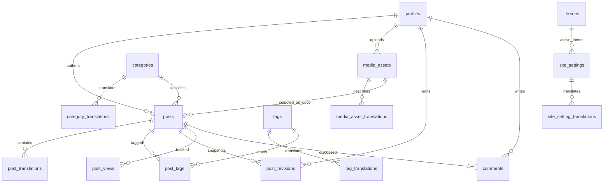

# Database Schema

## Current State

The schema is already implemented through Supabase migrations and supports:

- authenticated profiles and roles
- public blog content
- translation-capable content storage
- tags and categories
- media metadata
- revision history
- comment moderation
- lightweight post view tracking
- site settings and theme presets

## Core Enums

### `public.app_role`

- `admin`
- `editor`
- `author`

### `public.post_status`

- `draft`
- `scheduled`
- `published`
- `archived`

### `public.comment_status`

- `pending`
- `approved`
- `rejected`
- `spam`

## Main Tables

### `profiles`

Purpose:

- stores application-level user data linked to `auth.users`

Important columns:

- `id`
- `email`
- `display_name`
- `role`
- `preferred_locale`
- `preferred_theme_mode`
- `avatar_url`

### `posts`

Purpose:

- stores shared post metadata

Important columns:

- `author_id`
- `category_id`
- `status`
- `hero_media_id`
- `published_at`
- `is_featured`
- `reading_time_minutes`

### `post_translations`

Purpose:

- stores locale-specific post content

Important columns:

- `post_id`
- `locale`
- `title`
- `slug`
- `excerpt`
- `content`
- `seo_title`
- `seo_description`
- `cover_alt`
- `is_complete`

Current note:

- the app still stores post content in translation rows
- the current editor does not force both locales to be filled
- public pages use locale preference plus fallback behavior

### `categories` and `category_translations`

Purpose:

- shared category identity plus translated labels and slugs

### `tags` and `tag_translations`

Purpose:

- shared tag identity plus translated labels and slugs

### `post_tags`

Purpose:

- many-to-many mapping between posts and tags

### `media_assets`

Purpose:

- tracks uploaded images stored in Supabase Storage

Important columns:

- `uploaded_by`
- `bucket_name`
- `storage_path`
- `file_name`
- `mime_type`
- `file_size_bytes`
- `width`
- `height`

### `media_asset_translations`

Purpose:

- stores translated alt text and captions for media assets

### `themes`

Purpose:

- stores theme presets

Important columns:

- `name`
- `slug`
- `is_active`
- `tokens`

Current note:

- token data includes light-mode values plus nested dark-mode values
- only one active theme is allowed at a time

### `comments`

Purpose:

- stores comment records and moderation state

Important columns:

- `post_id`
- `author_id`
- `parent_comment_id`
- `status`
- `author_name`
- `author_email`
- `content`
- `locale`

Current note:

- public comment creation UI is not implemented yet
- moderation UI is implemented for editors and admins

### `post_revisions`

Purpose:

- stores post save snapshots for editorial history

Important columns:

- `post_id`
- `translation_id`
- `revision_number`
- `edited_by`
- `snapshot`
- `change_summary`

### `post_views`

Purpose:

- stores lightweight post view events

Important columns:

- `post_id`
- `locale`
- `viewer_hash`
- `referrer`
- `user_agent`
- `viewed_at`

### `site_settings`

Purpose:

- stores global presentation and behavior settings

Important columns:

- `default_locale`
- `active_theme_id`
- `posts_per_page`
- `updated_by`

### `site_setting_translations`

Purpose:

- stores translated site-level public text

Important columns:

- `site_settings_id`
- `locale`
- `site_name`
- `site_description`

## Entity Relationships

## Indexes Already In Place

Implemented indexes include:

- `posts(status, published_at desc)`
- `posts(author_id)`
- `post_translations(locale, slug)`
- `post_translations(locale, title)`
- `category_translations(locale, slug)`
- `tag_translations(locale, slug)`
- `media_assets(uploaded_by, created_at desc)`
- `media_asset_translations(locale, media_asset_id)`
- `comments(post_id, status, created_at desc)`
- `post_revisions(post_id, revision_number desc)`
- `post_views(post_id, viewed_at desc)`
- `site_setting_translations(locale, site_settings_id)`

## RLS Summary

### Public read

Public or anonymous access is available for:

- published posts
- related post translations
- public categories and tags
- active theme
- public site settings
- media metadata and public bucket assets
- approved comments only

### Authenticated author access

Authors can:

- manage their own posts and translations
- create revisions for their own posts
- read their own profile

### Editor and admin access

Editors and admins can:

- manage posts across the workspace
- moderate comments
- use the protected media workflow
- read post view analytics

### Admin-only access

Admins can:

- manage theme presets
- manage global site settings
- read all profiles where allowed by policy

## Storage

### Bucket

- `blog-media`

### Current app usage

- uploaded images are stored in Supabase Storage
- metadata is mirrored into `media_assets`
- post cover image selection uses `posts.hero_media_id`

## Important Implementation Notes

- the schema remains translation-ready even though the current content editor is not dual-language-first
- theme presets are database-backed and now flow into the runtime theme provider
- comment moderation is implemented before public comment submission
- view tracking is intentionally lightweight, not a full analytics stack

## Source Of Truth

Migration files:

- [supabase/migrations/20260606232000_initial_schema.sql](D:/git/blog-for-user-interactive/supabase/migrations/20260606232000_initial_schema.sql)
- [supabase/migrations/20260606232100_rls_policies.sql](D:/git/blog-for-user-interactive/supabase/migrations/20260606232100_rls_policies.sql)

Seed file:

- [supabase/seed.sql](D:/git/blog-for-user-interactive/supabase/seed.sql)
