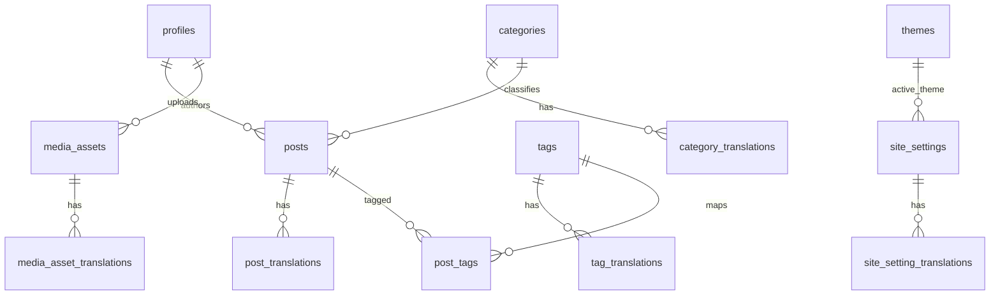

# Database Schema

## 1. Schema Goals

The schema must support:

- bilingual blog content
- secure admin workflows
- public read access to published content only
- image storage metadata
- theme management
- persisted user preferences
- comments
- revision history
- basic post view tracking

## 2. Design Principles

- Keep shared entity metadata separate from translated content
- Use translation tables for locale-specific fields
- Use UUID primary keys
- Enable Row Level Security
- Track creation and update timestamps consistently

## 3. Core Locales

Supported locales:

- `en`
- `zh-CN`

## 4. Entity Overview

## 5. Tables

### 5.1 `profiles`

Purpose:

- stores application-level data for authenticated users

Columns:

- `id uuid primary key` references `auth.users(id)`
- `email text unique`
- `display_name text`
- `role text not null default 'editor'`
- `preferred_locale text not null default 'zh-CN'`
- `preferred_theme_mode text not null default 'system'`
- `avatar_url text`
- `created_at timestamptz not null default now()`
- `updated_at timestamptz not null default now()`

Notes:

- `role` should be constrained to allowed values such as `admin`, `editor`, and `author`
- `preferred_locale` persists the user language choice

### 5.2 `posts`

Purpose:

- stores language-neutral post metadata

Columns:

- `id uuid primary key`
- `author_id uuid not null`
- `category_id uuid null`
- `status text not null default 'draft'`
- `hero_media_id uuid null`
- `published_at timestamptz null`
- `is_featured boolean not null default false`
- `reading_time_minutes integer null`
- `created_at timestamptz not null default now()`
- `updated_at timestamptz not null default now()`

Notes:

- `status` should allow at least `draft`, `scheduled`, `published`, `archived`
- shared metadata should not be duplicated in translation rows unless locale-specific

### 5.3 `post_translations`

Purpose:

- stores locale-specific post content

Columns:

- `id uuid primary key`
- `post_id uuid not null`
- `locale text not null`
- `title text not null`
- `slug text not null`
- `excerpt text null`
- `content jsonb not null`
- `seo_title text null`
- `seo_description text null`
- `cover_alt text null`
- `is_complete boolean not null default false`
- `created_at timestamptz not null default now()`
- `updated_at timestamptz not null default now()`

Constraints:

- unique `(post_id, locale)`
- unique `(locale, slug)`

Notes:

- `content` can store structured rich text output
- `is_complete` helps the admin dashboard show translation status

### 5.4 `categories`

Purpose:

- shared category identity

Columns:

- `id uuid primary key`
- `sort_order integer not null default 0`
- `created_at timestamptz not null default now()`
- `updated_at timestamptz not null default now()`

### 5.5 `category_translations`

Purpose:

- locale-specific category labels and slugs

Columns:

- `id uuid primary key`
- `category_id uuid not null`
- `locale text not null`
- `name text not null`
- `slug text not null`
- `description text null`
- `created_at timestamptz not null default now()`
- `updated_at timestamptz not null default now()`

Constraints:

- unique `(category_id, locale)`
- unique `(locale, slug)`

### 5.6 `tags`

Purpose:

- shared tag identity

Columns:

- `id uuid primary key`
- `created_at timestamptz not null default now()`
- `updated_at timestamptz not null default now()`

### 5.7 `tag_translations`

Purpose:

- locale-specific tag labels and slugs

Columns:

- `id uuid primary key`
- `tag_id uuid not null`
- `locale text not null`
- `name text not null`
- `slug text not null`
- `created_at timestamptz not null default now()`
- `updated_at timestamptz not null default now()`

Constraints:

- unique `(tag_id, locale)`
- unique `(locale, slug)`

### 5.8 `post_tags`

Purpose:

- many-to-many relation between posts and tags

Columns:

- `post_id uuid not null`
- `tag_id uuid not null`

Constraints:

- primary key `(post_id, tag_id)`

### 5.9 `media_assets`

Purpose:

- tracks uploaded files stored in Supabase Storage

Columns:

- `id uuid primary key`
- `uploaded_by uuid not null`
- `bucket_name text not null default 'blog-media'`
- `storage_path text not null`
- `file_name text not null`
- `mime_type text not null`
- `file_size_bytes bigint not null`
- `width integer null`
- `height integer null`
- `created_at timestamptz not null default now()`

Notes:

- locale-specific media text belongs in a translation table for consistency

### 5.10 `media_asset_translations`

Purpose:

- locale-specific media alt text and captions

Columns:

- `id uuid primary key`
- `media_asset_id uuid not null`
- `locale text not null`
- `alt_text text null`
- `caption text null`
- `created_at timestamptz not null default now()`
- `updated_at timestamptz not null default now()`

Constraints:

- unique `(media_asset_id, locale)`

### 5.11 `themes`

Purpose:

- stores theme presets manageable from admin

Columns:

- `id uuid primary key`
- `name text not null unique`
- `slug text not null unique`
- `is_active boolean not null default false`
- `tokens jsonb not null`
- `created_by uuid not null`
- `created_at timestamptz not null default now()`
- `updated_at timestamptz not null default now()`

Notes:

- `tokens` stores validated design token values

### 5.12 `comments`

Purpose:

- stores public comments for posts with moderation support

Columns:

- `id uuid primary key`
- `post_id uuid not null`
- `author_id uuid null`
- `parent_comment_id uuid null`
- `status text not null default 'pending'`
- `author_name text null`
- `author_email text null`
- `content text not null`
- `locale text not null`
- `created_at timestamptz not null default now()`
- `updated_at timestamptz not null default now()`

Notes:

- `status` should allow at least `pending`, `approved`, `rejected`, `spam`
- nullable `author_id` supports guest comments if enabled later

### 5.13 `post_revisions`

Purpose:

- stores post revision snapshots for editorial history and rollback

Columns:

- `id uuid primary key`
- `post_id uuid not null`
- `translation_id uuid null`
- `revision_number integer not null`
- `edited_by uuid not null`
- `snapshot jsonb not null`
- `change_summary text null`
- `created_at timestamptz not null default now()`

Constraints:

- unique `(post_id, revision_number)`

Notes:

- `snapshot` should capture the relevant post and translation state at save time
- `translation_id` can be null for revisions affecting language-neutral metadata

### 5.14 `post_views`

Purpose:

- stores basic post view events for lightweight analytics

Columns:

- `id uuid primary key`
- `post_id uuid not null`
- `locale text not null`
- `viewer_hash text null`
- `referrer text null`
- `user_agent text null`
- `viewed_at timestamptz not null default now()`

Notes:

- this supports basic counting without implementing a full analytics platform
- `viewer_hash` can be used later for simple de-duplication if needed

### 5.15 `site_settings`

Purpose:

- stores global app settings

Columns:

- `id integer primary key default 1`
- `default_locale text not null default 'zh-CN'`
- `active_theme_id uuid null`
- `posts_per_page integer not null default 10`
- `updated_by uuid null`
- `updated_at timestamptz not null default now()`

Notes:

- keep only locale-neutral values in this table

### 5.16 `site_setting_translations`

Purpose:

- locale-specific global site text

Columns:

- `id uuid primary key`
- `site_settings_id integer not null`
- `locale text not null`
- `site_name text not null`
- `site_description text null`
- `created_at timestamptz not null default now()`
- `updated_at timestamptz not null default now()`

Constraints:

- unique `(site_settings_id, locale)`

## 6. Recommended Foreign Keys

- `posts.author_id -> profiles.id`
- `posts.category_id -> categories.id`
- `posts.hero_media_id -> media_assets.id`
- `post_translations.post_id -> posts.id`
- `category_translations.category_id -> categories.id`
- `tag_translations.tag_id -> tags.id`
- `post_tags.post_id -> posts.id`
- `post_tags.tag_id -> tags.id`
- `media_assets.uploaded_by -> profiles.id`
- `media_asset_translations.media_asset_id -> media_assets.id`
- `themes.created_by -> profiles.id`
- `comments.post_id -> posts.id`
- `comments.author_id -> profiles.id`
- `comments.parent_comment_id -> comments.id`
- `post_revisions.post_id -> posts.id`
- `post_revisions.translation_id -> post_translations.id`
- `post_revisions.edited_by -> profiles.id`
- `post_views.post_id -> posts.id`
- `site_settings.active_theme_id -> themes.id`
- `site_settings.updated_by -> profiles.id`
- `site_setting_translations.site_settings_id -> site_settings.id`

## 7. Recommended Indexes

- index on `posts(status, published_at desc)`
- index on `posts(author_id)`
- index on `post_translations(locale, slug)`
- index on `post_translations(locale, title)`
- index on `category_translations(locale, slug)`
- index on `tag_translations(locale, slug)`
- index on `media_assets(uploaded_by, created_at desc)`
- index on `media_asset_translations(locale, media_asset_id)`
- index on `comments(post_id, status, created_at desc)`
- index on `post_revisions(post_id, revision_number desc)`
- index on `post_views(post_id, viewed_at desc)`
- index on `site_setting_translations(locale, site_settings_id)`

## 8. Row Level Security Model

### Public Read

Allow public read for:

- published posts
- related translation rows for published posts
- active theme
- required site settings
- publicly renderable media metadata

### Editor Access

Allow authenticated editors to:

- create and update posts
- create and update translation rows
- create revisions through editorial save flows
- upload media
- read dashboard data

### Admin Access

Allow admins to:

- manage users where needed
- manage themes
- manage global settings
- moderate comments
- publish or archive content if the workflow requires stricter control

## 9. Storage Structure Recommendation

Supabase Storage bucket:

- `blog-media`

Suggested path structure:

- `posts/{postId}/hero/...`
- `posts/{postId}/content/...`
- `themes/{themeId}/...`
- `users/{userId}/...`

## 10. Content Publishing Rules

Recommended public eligibility for a post:

- `posts.status = 'published'`
- `posts.published_at <= now()`
- matching locale translation exists
- translation marked complete if the team wants stricter quality control

## 11. Bilingual Support Strategy

### UI Text

- stored in Next.js locale dictionary files

### Editorial Content

- stored in translation tables

### User Preference

- stored in `profiles.preferred_locale`
- also persisted client-side for anonymous users

## 12. Future Extensions

The schema is ready to extend for:

- comments
- reactions
- newsletter subscriptions
- scheduled publishing jobs
- audit logs
- content revision history

## 13. Recommended Initial Migration Order

1. `profiles`
2. `categories`
3. `tags`
4. `media_assets`
5. `media_asset_translations`
6. `posts`
7. `post_translations`
8. `category_translations`
9. `tag_translations`
10. `post_tags`
11. `themes`
12. `comments`
13. `post_revisions`
14. `post_views`
15. `site_settings`
16. `site_setting_translations`
